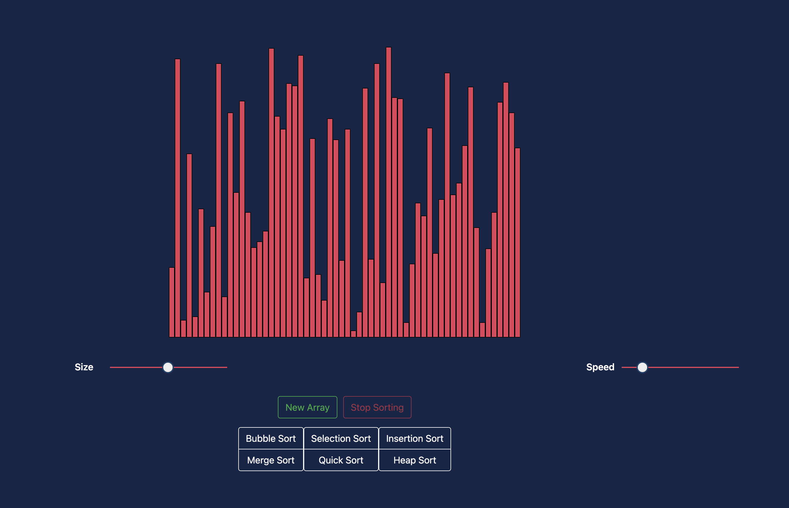

# 🌠 Sorting Visualizer 🌠


Sorting Visualizer built using HTML,CSS and Javascript to see the various sorting algorithms at work. 





### Algorithms Covered

Bubble Sort
Heap Sort
Insertion Sort
Merge Sort
Quick Sort
Selection Sort


### Tech Stack

| Technology | Description                                                                           | 
| ---------- | ------------------------------------------------------------------------------------- | 
| HTML5      | Hyper Text Markup Language                                                            | 
| CSS3       | Cascading Style Sheets                                                                | 
| JavaScript | High Level, Dynamic, Interpreted Language                                             | 


### How to View


1. Clone or Download the repository (Depending on whether you are using SSH or HTTPS)

```bash
$ git clone https://github.com/sid6932/Sorting-Visualizer.git
$ cd Sorting-Visualizer
```


2. View the Page

Click on the index.html file to view the page in browser. 

